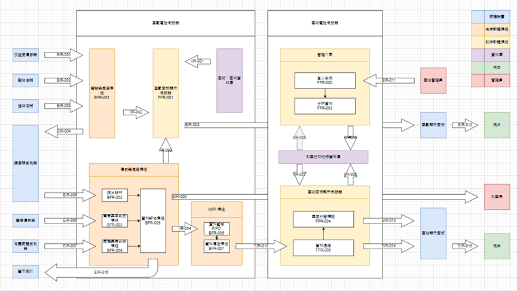

# SubwayEaseUp
##	系統名稱
**便"捷"e起來 (English: SubwayEaseUp)**

## 系統目的與範圍
### 一、針對捷運車站面板改進 :
在繁忙地通勤捷運時間中，我們注意到人們總是喜歡在車站入口處的門等候。列車進站後，我們觀察到車廂人分布不均，大部分人都集中在特定車廂。上車後，人們很少會選擇移動到別的車廂。因此，如果能讓在候車的人提前知道列車擁擠狀態，就能提前變更位置候車。

我們的系統改善現有捷運車站面板，利用車載攝像機拍攝照片分析擁擠狀態，將資料上傳到伺服器，並顯示到車站面板中。我們目的是用簡單插圖讓人們更了解下班車的人群分布，解決過度集中車廂問題。

### 二、針對捷運車廂內車載面板改進 :
此外，對於現有的車載面板將予以優化，用顯示面板取代LED跑馬燈，我們車載面板區分成兩個狀態，進佔狀態以及行進狀態。

1.	進站狀態:
    在此模式下，列車會顯示下個車站的配置圖，並且利用圖示標示出口方向，以及各出口地標。並同時顯示開門是本側或是對側。這有效解決LED 面板無法常駐顯示開門位置，以及車站資訊問題。

2.	行進狀態: 
    此模式下，換顯示路線圖，並寫出下面數個車站預計到達時間給予乘客參考，新增了可以提供乘客參照到達時間，方便乘客提前做規劃，如通知親友接送等。

### 三、針對捷運車廂內額外監測:
在此之上，我們額外針對之前曾經發生的管道洩漏事故做預防，我們的系統同時會收集有毒氣體資訊，若有偵測顯著異常會通報給列車長，以便進行快速反應。

最後，我們想藉此機會，強化安全預警。我們利用分析車廂音頻，找出可能發生異常危害狀況車廂，並及時顯示在面板並放出警告，讓歹徒的危害降至最小，並給其他車廂乘客增加反應時間。

### 四、系統架構

